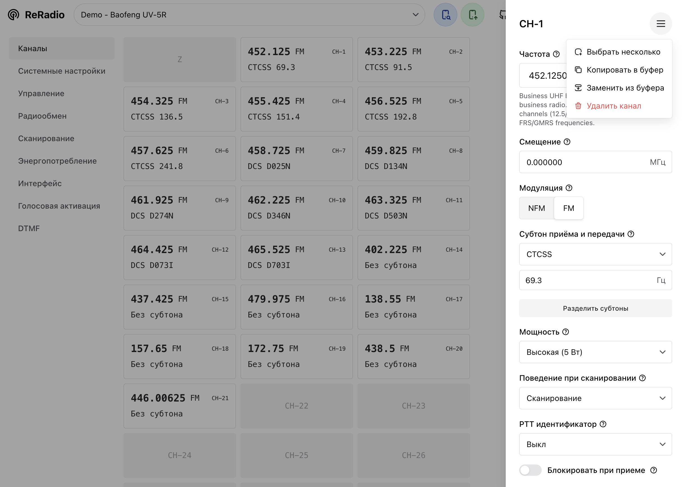

# ReRadio

Инструмент для программирования радиостанций прямо из браузера.

## Только Chromium

ReRadio возможен только потому, что в браузерах на базе Chromium есть поддержка [Web Serial API](https://developer.mozilla.org/en-US/docs/Web/API/Web_Serial_API). Именно этот протокол используется для общения с радиостанциями.

- Google Chrome
- Microsoft Edge
- Opera

## Проблема или вопрос?

Создай Issue на GitHub!

В свободной форме опиши проблему. По возможности приложи лог из консоли браузера.

Запросы на добавление новых станций тоже принимаются.

## English?

Until an international developer community emerges, the source code will remain in Russian.

## Common UI: понятный интерфейс

Интерфейс должен быть простым, понятным и узнаваемым. При переходе от станции к станции, не нужно искать нужные функции: они всегда на своем месте. Новым пользователям и новичкам в радио функции должны быть понятны без дополнительных разъяснений. Интерфейс должен сам себя объяснять.

Эту задачу призван решить Common UI - набор готовых элементов для интерфейса настроек.

Основа библиотеки - простые элементы ввода (число, текст, раскрывающийся список). На этом строится готовый элемент настройки (roger beep, vox, ...) - они уже включают название, описание, группировку и упрощенный API для использования. Использование и расширение Common UI - ключ к созданию хорошего интерфейса.

Каналы настраиваются с помощью готовой формы с фиксированным набором атрибутов. Ничего не противоречит добавлению туда других элементов из Common UI.

## Локализация

Другим важным аспектом хорошего интерфейса является поддержка разных языков. Людям приятно работать на родном языке, а иногда это может быть не просто неудобством, а стоп-фактором.

Английский - основной язык программы. Этот язык должен использоваться в случае, если какой то текст не был переведен на другие языки.

Русский - второй обязательный язык. Если какой то текст добавляется в файл локализации, он должен быть переведен на русский.

Остальные языки могут быть добавлены по необходимости.

## Как добавить станцию?

Все драйвера находятся в папке `src/drivers`. Посмотри, как реализованы другие простые станции, чтобы понять принцип разработки. Хороший пример - Baofeng BF-888 `src/drivers/bf888.ts`.

Есть несколько обязательных элементов драйвера:
- `static Info` - информация о станции;
- `ui()` - описание интерфейса настроек;
- `async read()` - чтение настроек из станции;
- `async write()` - загрузка настроек в станцию.

### Serial

Все драйвера предполагают работу через последовательный интерфейс. Вся работу по его открытию, прослушиванию, закрытию итд выполняется в ядровой части приложения.

В момент вызова `read()` или `write()` подключение уже будет установлено. Все бинарные данные оборачиваются в `Buffer`. Для этого подключен полифил, работает как в NodeJS. Отправлять или читать данные в порт можно через специальные методы:
- `async _serial_read(size, {timeout?})`
- `async _serial_write(data)`

### React

Хотя приложение и построено на React, драйвера не взаимодействуют с ним напрямую. Драйвер содержит состояние и описание ui. Для синхронизации состояния с React интерфейсом используй эти функции:
- `dispatch_ui()` - когда обновляется значение в настройках
- `dispatch_ui_change()` - когда меняется набор настроек
- `dispatch_progress(0..1)` - по ходу выполнения чтения или загрузки.

---

Вдохновлено CHIRP ❤️